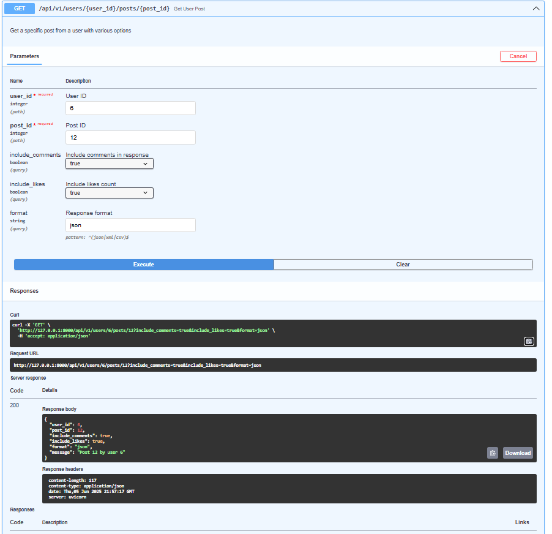
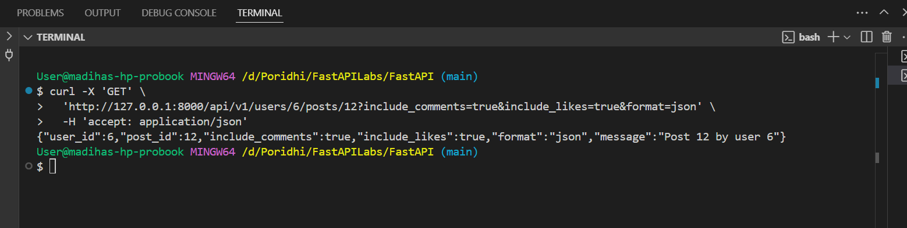

# FastAPI Learning Labs

A comprehensive collection of FastAPI labs designed to teach modern Python web API development from fundamentals to advanced concepts.

## 📋 Table of Contents

- [What is FastAPI?](#what-is-fastapi)
- [FastAPI vs Flask](#fastapi-vs-flask)
- [API Documentation](#api-documentation)
- [Installation](#installation)
- [Project Structure](#project-structure)
- [Labs Overview](#labs-overview)
- [Lab 01: FastAPI Fundamentals](#lab-01-fastapi-fundamentals)
- [Running the Labs](#running-the-labs)
- [Next Steps](#next-steps)

## What is FastAPI?

FastAPI is a modern, fast (high-performance), web framework for building APIs with Python 3.7+ based on standard Python type hints. It's designed to be easy to use, fast to code, and production-ready.

### Key Features:
- **Fast**: Very high performance, on par with NodeJS and Go
- **Fast to code**: Increase development speed by 200-300%
- **Fewer bugs**: Reduce human-induced errors by 40%
- **Intuitive**: Great editor support with auto-completion
- **Easy**: Designed to be easy to use and learn
- **Short**: Minimize code duplication
- **Robust**: Get production-ready code with automatic interactive documentation
- **Standards-based**: Based on and fully compatible with OpenAPI and JSON Schema

## FastAPI vs Flask

| Feature | FastAPI | Flask |
|---------|---------|--------|
| **Performance** | Very High (async support) | Moderate |
| **Type Hints** | Built-in support | Manual implementation |
| **Data Validation** | Automatic with Pydantic | Manual with extensions |
| **Documentation** | Auto-generated (Swagger/ReDoc) | Manual setup required |
| **Async Support** | Native async/await | Limited (with extensions) |
| **Learning Curve** | Moderate | Easy |
| **API Standards** | OpenAPI 3.0 compliant | Manual implementation |
| **Request/Response** | Automatic serialization | Manual handling |

### When to Choose FastAPI:
- Building modern APIs with automatic documentation
- Need high performance and async support
- Want built-in data validation and serialization
- Prefer type safety and IDE support
- Building microservices or data-heavy applications
### What is uvicorn

Uvicorn is a lightning-fast ASGI (Asynchronous Server Gateway Interface) server designed to run asynchronous Python web applications. It’s the preferred server for frameworks like FastAPI that are built to handle asynchronous code efficiently.

#### Why Uvicorn with FastAPI?
FastAPI leverages Python’s async/await syntax to maximize concurrency and speed, especially when dealing with I/O-bound operations like database queries or external API calls. To run this async code properly, you need an ASGI server like Uvicorn, which can handle asynchronous event loops and concurrency seamlessly.

#### How is this different from Flask and Node.js?
Flask is synchronous and built on WSGI (Web Server Gateway Interface). It doesn’t require an ASGI server because it handles requests one at a time in a blocking manner. Running async code in Flask isn’t native or efficient.

Node.js is built on an asynchronous event-driven architecture by default, so it doesn’t need an extra server like Uvicorn. It’s designed to handle async operations natively.


## API Documentation

One of FastAPI's most powerful features is automatic API documentation generation:

### Interactive Documentation
Once your application is running, you can access:

- **Swagger UI**: `http://localhost:8000/docs`
  - Interactive API documentation
  - Test endpoints directly in the browser
  - View request/response schemas
  - Generate code examples

- **ReDoc**: `http://localhost:8000/redoc`
  - Alternative documentation interface
  - Clean, professional appearance
  - Better for API reference documentation

### OpenAPI Schema
- **JSON Schema**: `http://localhost:8000/openapi.json`
  - Raw OpenAPI 3.0 specification
  - Use for generating client SDKs
  - Integration with API tools

### Documentation Features:
- Automatic schema generation from type hints
- Parameter descriptions and examples
- Response model documentation
- Error response documentation
- Authentication requirements
- Endpoint grouping and tagging


## Installation

### Prerequisites
- Python 3.7 or higher
- pip (Python package installer)

### Setup Steps

1. **Clone the repository**
   ```bash
   git clone https://github.com/madiha-ahmed-chowdhury/FastAPI.git
   cd FastAPI
   ```

2. **Navigate to any lab directory (e.g., lab01)**
   ```bash
   cd lab01
   ```

3. **Create a virtual environment**
   ```bash
   python -m venv venv
   ```

4. **Activate the virtual environment**
   
   **Windows:**
   ```bash
   venv\Scripts\activate.bat
   ```
   
   **macOS/Linux:**
   ```bash
   source venv/bin/activate
   ```

5. **Install required packages**
   ```bash
   pip install fastapi
   pip install uvicorn
   ```

6. **Run the application**
   ```bash
   uvicorn app.main:app --reload
   ```

The `--reload` flag enables auto-reload during development, so the server restarts automatically when you make changes to your code.

## Project Structure

```
fastapi-labs/
├── README.md
├── lab01/
│   ├── app/
│   │   └── main.py
│   └── venv/
├── lab02/
│   ├── app/
│   │   └── main.py
│   └── venv/
├── lab03/
│   └── ...
├── ...
└── lab12/
    └── ...
```

## Labs Overview

| Lab | Topic | Key Concepts |
|-----|-------|--------------|
| **Lab 01** | FastAPI Fundamentals | Path parameters, Query parameters, Validation |


## Lab 01: FastAPI Fundamentals

The first lab introduces core FastAPI concepts through practical examples:

### Goals
 - Set up FastAPI project
 - Create a basic /ping health check endpoint
 - Learn path/query parameters

### FastAPI Path and Query Parameters Guide

#### Path Parameters

Path parameters are **required** parts of the URL path, defined with curly braces `{}`.

##### Single Path Parameter
```python
@app.get("/user/{user_id}")
def get_user(user_id: int):
    return {"user_id": user_id}
```
**Usage**: `GET /user/5`

##### Multiple Path Parameters
```python
@app.get("/blogs/{blog_id}/comments/{comment_id}")
def get_comment(blog_id: int, comment_id: int):
    return {"blog_id": blog_id, "comment_id": comment_id}
```
**Usage**: `GET /blogs/10/comments/3`

##### Path Parameter Validation
```python
@app.get("/user/{user_id}")
def get_user(user_id: int = Path(..., gt=0, description="User ID must be positive")):
    return {"user_id": user_id}
```

#### Query Parameters

Query parameters appear after `?` in the URL and are separated by `&`.

##### Default Query Parameters
Parameters with default values can be **skipped** in the request:

```python
@app.get("/blog/all")
def get_blogs(page: int = Query(1), page_size: int = Query(10)):
    return {"page": page, "page_size": page_size}
```

**Usage**:
- `GET /blog/all` → uses defaults (page=1, page_size=10)
- `GET /blog/all?page=2` → page=2, page_size=10 (default)
- `GET /blog/all?page=2&page_size=20` → both specified

##### Optional Query Parameters
Optional parameters become `None` when not provided:

```python
@app.get("/blog/search")
def search_blogs(
    q: Optional[str] = Query(None),
    category: Optional[str] = Query(None),
    author: Optional[str] = Query(None)
):
    return {"q": q, "category": category, "author": author}
```

**Usage**:
- `GET /blog/search` → all parameters are `None`
- `GET /blog/search?q=python` → q="python", others are `None`
- `GET /blog/search?q=python&author=john` → q="python", author="john", category=`None`

##### Parameter Validation/Filters

FastAPI provides built-in validation for parameters:

###### Numeric Validation
```python
@app.get("/products/{product_id}")
def get_product(
    product_id: int = Path(..., ge=1, le=999999),  # Between 1 and 999999
    discount: float = Query(None, ge=0.0, le=100.0)  # 0% to 100%
):
    return {"product_id": product_id, "discount": discount}
```

###### String Validation
```python
@app.get("/test")
def test_params(
    name: str = Query(..., min_length=1, max_length=50),  # 1-50 characters
    email: str = Query(..., regex=r'^[^@]+@[^@]+\.[^@]+$')  # Email format
):
    return {"name": name, "email": email}
```

###### List Parameters
```python
@app.get("/search")
def search(tags: List[str] = Query([])):
    return {"tags": tags}
```
**Usage**: `GET /search?tags=python&tags=web&tags=api`

#### Combining Path and Query Parameters

```python
@app.get("/api/v1/users/{user_id}/posts/{post_id}")
def get_user_post(
    # Required path parameters
    user_id: int = Path(..., gt=0),
    post_id: int = Path(..., gt=0),
    
    # Optional query parameters with defaults
    include_comments: bool = Query(False),
    include_likes: bool = Query(False),
    format: str = Query("json")
):
    return {
        "user_id": user_id,
        "post_id": post_id,
        "include_comments": include_comments,
        "include_likes": include_likes,
        "format": format
    }
```

**Usage Examples**:
- `GET /api/v1/users/5/posts/12` → uses all defaults
- `GET /api/v1/users/5/posts/12?include_comments=true` → only comments included
- `GET /api/v1/users/5/posts/12?include_comments=true&include_likes=true&format=xml`

#### Key Differences

| Feature | Path Parameters | Query Parameters |
|---------|----------------|------------------|
| **Required** | Always required | Can be optional |
| **Position** | Fixed position in URL | After `?`, any order |
| **Default Values** | Not supported | Supported |
| **None Values** | Not applicable | Supported with Optional |
| **URL Structure** | `/users/{id}` | `/users?page=1&size=10` |

#### Common Validation Filters

- **Numeric**: `ge` (≥), `gt` (>), `le` (≤), `lt` (<)
- **String**: `min_length`, `max_length`, `regex`
- **General**: `description` for documentation

#### Best Practices

1. Use **path parameters** for resource identification (user ID, post ID)
2. Use **query parameters** for filtering, pagination, and optional features
3. Provide **default values** for commonly used query parameters
4. Use **Optional** for parameters that can be skipped
5. Add **validation** to ensure data integrity
6. Include **descriptions** for better API documentation

### Endpoints Covered:

#### Health Check
- **GET** `/ping` - Simple health check endpoint

#### Basic Greetings
- **GET** `/hello` - Basic greeting with default parameter
- **GET** `/hello/{name}` - Greeting with path parameter

#### Path Parameters
- **GET** `/blog/type/{type}` - Enum validation for blog types
- **GET** `/user/{user_id}` - Integer validation with constraints
- **GET** `/blogs/{blog_id}/comments/{comment_id}` - Multiple path parameters

#### Query Parameters
- **GET** `/blog/all` - Pagination with query parameters
- **GET** `/blog/search` - Multiple optional query filters
- **GET** `/api/v1/users/{user_id}/posts/{post_id}` - Complex parameter combinations

#### Validation Examples
- **GET** `/validate/email/{email}` - Email format validation with regex
- **GET** `/products/{product_id}` - Numeric validation and constraints
- **GET** `/test/parameters` - Comprehensive parameter type testing

### Key Learning Points:
- Path parameter validation using `Path()`
- Query parameter validation using `Query()`
- Enum validation for restricted values
- String validation with regex patterns
- Numeric constraints (ge, le, gt, lt)
- Optional parameters with default values
- List parameters for multiple values
- Combining path and query parameters

### FastAPI Endpoint Ordering Guide

Why endpoint ordering matters in FastAPI and how to do it correctly.

#### Why Ordering Matters

FastAPI matches routes **from top to bottom** using a **first-match wins** approach. Once it finds a matching pattern, it stops looking and executes that endpoint.

#### ❌ Wrong Order Example

```python
from fastapi import FastAPI

app = FastAPI()

# This general route comes first - PROBLEM!
@app.get("/users/{user_id}")
def get_user(user_id: str):
    return {"user_id": user_id}

# This will NEVER be reached because "me" matches {user_id}
@app.get("/users/me")
def get_current_user():
    return {"message": "Current user info"}
```

#### ✅ Correct Order Example

```python
from fastapi import FastAPI
from enum import Enum

app = FastAPI()

class ItemType(str, Enum):
    electronics = "electronics"
    books = "books"

# 1. Static/specific paths FIRST
@app.get("/users/me")
def get_current_user():
    return {"message": "Current user info"}

@app.get("/users/stats")
def get_user_stats():
    return {"message": "User statistics"}

# 2. Constrained parameters (enums) SECOND
@app.get("/items/category/{category}")
def get_items_by_category(category: ItemType):
    return {"category": category}

# 3. General parameters LAST
@app.get("/users/{user_id}")
def get_user(user_id: int):
    return {"user_id": user_id}

@app.get("/items/{item_id}")
def get_item(item_id: int):
    return {"item_id": item_id}
```

#### Golden Rule

**Order your endpoints from MOST SPECIFIC to LEAST SPECIFIC:**

1. **Static paths** (e.g., `/users/me`, `/items/search`)
2. **Constrained parameters** (e.g., enums, specific types)
3. **General parameters** (e.g., `/{user_id}`, `/{item_id}`)

#### 🧪 Quick Test

If your ordering is correct:
- `/users/me` → hits the specific endpoint
- `/users/123` → hits the general `{user_id}` endpoint
- `/items/search` → hits search endpoint, not `{item_id}`

Remember: **Specific routes first, general routes last!**


### Testing Endpoints
#### API Testing Guide

##### Access Interactive Documentation

When your FastAPI server is running, go to:
```
http://localhost:8000/docs
```

##### Testing Endpoints


###### Using the Interactive Docs
1. Find the endpoint you want to test
2. Click on it to expand
3. Click "Try it out"
4. Fill in the parameters (like in the screenshot: user_id=5, post_id=12)
5. Click "Execute"
6. View the response

###### Using cURL Commands


Copy the request URL from the docs and use it with cURL:

```bash
curl -X 'GET' \
  'http://127.0.0.1:8000/api/v1/users/6/posts/12?include_comments=true&include_likes=true&format=json' \
  -H 'accept: application/json'
```

###### Using Browser

For GET requests, copy the URL from the docs and paste directly into your browser:
```
http://127.0.0.1:8000/api/v1/users/5/posts/12?include_comments=true&include_likes=true&format=json
```

##### Quick Testing Steps

1. **Start your FastAPI server**
2. **Go to** `http://localhost:8000/docs`
3. **Find your endpoint** in the list
4. **Click and test** using the interface
5. **Copy the cURL command** if you need to use it elsewhere

The interactive docs automatically generate the correct URLs and show you exactly what your API returns.

## Running the Labs
### FastAPI Development Setup Guide

#### Windows Setup for VS Code Terminal

**Important**: For Windows users working with multiline commands in VS Code, you'll need to configure Git Bash as your default terminal.

##### VS Code Terminal Configuration

Add this to your VS Code `settings.json`:

```json
{
  "terminal.integrated.profiles.windows": {
    "Git Bash": {
      "path": "C:\\Program Files\\Git\\bin\\bash.exe"
    }
  },
  "terminal.integrated.defaultProfile.windows": "Git Bash"
}
```

**Prerequisites**: 
- Install Git for Windows (includes Git Bash)
- This enables proper handling of Unix-style commands and multiline scripts

### Development Commands

#### Development Mode
```bash
# Navigate to any lab directory
cd lab01

# Activate virtual environment
venv\Scripts\activate.bat  # Windows Command Prompt
# or
source venv/bin/activate   # Git Bash/macOS/Linux

# Run with auto-reload
uvicorn app.main:app --reload
```

### Production Mode
```bash
# Run without reload for better performance
uvicorn app.main:app --host 0.0.0.0 --port 8000
```

#### Custom Configuration
```bash
# Run on different host/port
uvicorn app.main:app --host 127.0.0.1 --port 3000 --reload

# Run with specific log level
uvicorn app.main:app --log-level debug
```
