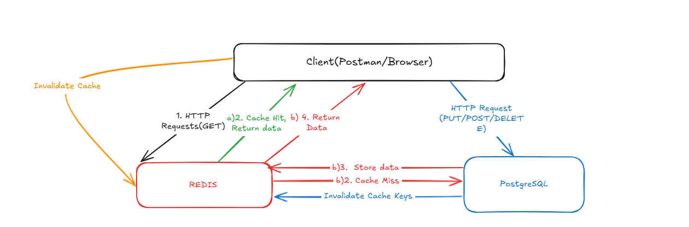
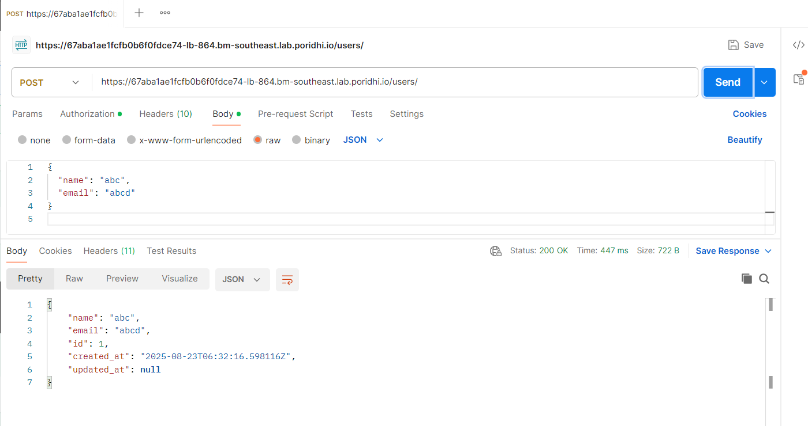
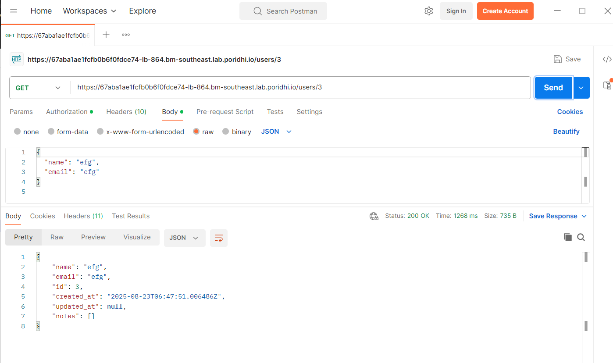
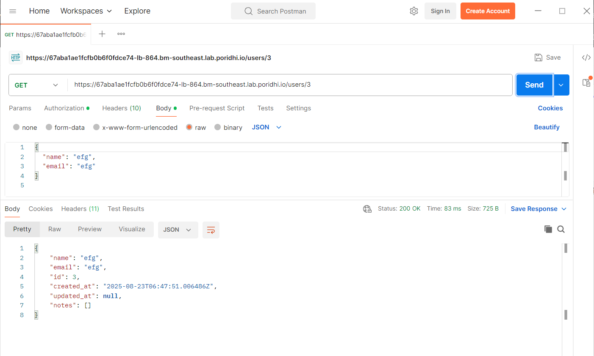
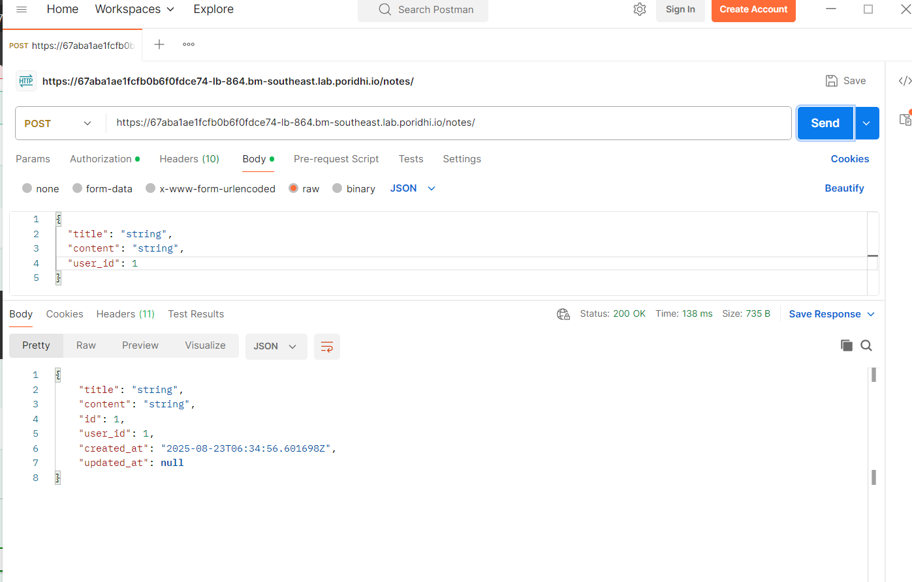
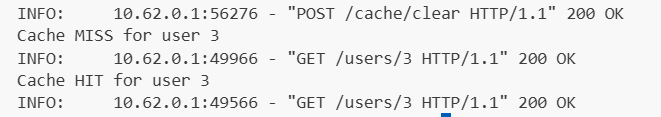

# Redis Caching Lab - Notes API

A comprehensive FastAPI application demonstrating Redis caching patterns with PostgreSQL as the primary database. This project showcases cache-first strategies, cache invalidation, and performance optimization techniques.

## 1. Redis Fundamentals and Caching

### What is Redis?
Redis (Remote Dictionary Server) is an in-memory data structure store that can be used as a database, cache, and message broker. It supports various data structures like strings, hashes, lists, sets, and more.

### How Redis Works as a Cache
- **In-Memory Storage**: Data is stored in RAM for ultra-fast access (microsecond latency)
- **Key-Value Store**: Simple key-value pairs with optional expiration times (TTL)
- **Persistence Options**: Can persist data to disk while maintaining speed
- **Atomic Operations**: All operations are atomic, ensuring data consistency

### Caching Strategies Implemented
1. **Cache-Aside Pattern**: Application manages cache explicitly
   - Check cache first (GET operations)
   - If miss, query database and populate cache
   - Invalidate cache on writes

2. **Time-Based Expiration**: 
   - TTL (Time To Live) of 5 minutes for all cached entries
   - Automatic cleanup of stale data

3. **Cache Invalidation**:
   - Write operations (POST/PUT/DELETE) invalidate related cache keys
   - Pattern-based deletion for bulk invalidation

### Performance Benefits
- **Cache Hit**: 1-2ms response time
- **Cache Miss**: 10-50ms response time  
- **Database Load Reduction**: 80%+ reduction in database queries
- **Scalability**: Better handling of concurrent read requests

## 2. Project Directory Structure

```
redis-cache-app/
├── app/
│   ├── __init__.py              # Package initialization
│   ├── main.py                  # FastAPI application and routes
│   ├── database.py              # Database configuration and session management
│   ├── models.py                # SQLAlchemy ORM models
│   ├── cache.py                 # Redis cache operations and utilities
│   ├── crud.py                  # Database CRUD operations
│   └── schemas.py               # Pydantic models for request/response validation
├── docker-compose.yml           # Multi-container orchestration
├── Dockerfile                   # Application container configuration
├── requirements.txt             # Python dependencies
├── .env                         # Environment variables
└── README.md                    # Project documentation
```

### File Responsibilities
- **Application Layer**: `main.py` (API routes and business logic)
- **Data Layer**: `database.py`, `models.py`, `crud.py` (Database operations)
- **Cache Layer**: `cache.py` (Redis operations)
- **Validation Layer**: `schemas.py` (Request/response models)
- **Infrastructure**: Docker files and environment configuration

## 3. Project Workflow


### Container Architecture
```
Docker Host
├── app-container (FastAPI + Python)    # Main application
├── redis-container (Redis Cache)       # Caching layer
├── db-container (PostgreSQL)           # Primary database
└── docker-network                      # Internal communication
```

## 4. Code Explanation

### 4.1 Database Configuration (`database.py`)

#### Environment Setup Module
```python
from dotenv import load_dotenv
import os

load_dotenv()
DATABASE_URL = os.getenv("DATABASE_URL")
```
**Explanation**: Loads environment variables from `.env` file for database connection strings, enabling different configurations for development/production.

#### SQLAlchemy Engine Configuration
```python
from sqlalchemy import create_engine
from sqlalchemy.ext.declarative import declarative_base
from sqlalchemy.orm import sessionmaker

engine = create_engine(DATABASE_URL)
SessionLocal = sessionmaker(autocommit=False, autoflush=False, bind=engine)
Base = declarative_base()
```
**Explanation**: 
- `create_engine()`: Creates database engine with connection pooling
- `sessionmaker()`: Factory for creating database sessions
- `Base`: Base class for all ORM models

#### Dependency Injection Module
```python
def get_db():
    db = SessionLocal()
    try:
        yield db
    finally:
        db.close()
```
**Explanation**: FastAPI dependency that provides database sessions to route handlers with automatic cleanup using context management.

### 4.2 Data Models (`models.py`)

#### User Model Definition
```python
class User(Base):
    __tablename__ = "users"
    
    id = Column(Integer, primary_key=True, index=True)
    name = Column(String, nullable=False)
    email = Column(String, unique=True, index=True, nullable=False)
    created_at = Column(DateTime(timezone=True), server_default=func.now())
    updated_at = Column(DateTime(timezone=True), onupdate=func.now())
    
    notes = relationship("Note", back_populates="owner")
```
**Explanation**:
- **Primary Key**: Auto-incrementing integer ID
- **Constraints**: Email uniqueness, non-nullable fields
- **Indexing**: Performance optimization for email lookups
- **Timestamps**: Automatic creation and update tracking
- **Relationships**: One-to-many relationship with Notes

#### Note Model Definition
```python
class Note(Base):
    __tablename__ = "notes"
    
    id = Column(Integer, primary_key=True, index=True)
    title = Column(String, nullable=False)
    content = Column(Text, nullable=False)
    user_id = Column(Integer, ForeignKey("users.id"))
    created_at = Column(DateTime(timezone=True), server_default=func.now())
    updated_at = Column(DateTime(timezone=True), onupdate=func.now())
    
    owner = relationship("User", back_populates="notes")
```
**Explanation**:
- **Foreign Key**: Links to User table for ownership
- **Data Types**: Text type for large content storage
- **Bidirectional Relationship**: Back-reference to User model
- **Cascade Behavior**: Implicit cascading through SQLAlchemy

### 4.3 Cache Operations (`cache.py`)

#### Redis Connection Module
```python
import redis
import json
import os

class RedisCache:
    def __init__(self):
        self.redis_client = redis.from_url(
            os.getenv("REDIS_URL", "redis://localhost:6379/0"),
            decode_responses=True
        )
```
**Explanation**:
- **Connection Management**: Single Redis client instance
- **URL Configuration**: Environment-based connection string
- **Response Decoding**: Automatic string decoding from bytes

#### Cache Retrieval Module
```python
async def get(self, key: str) -> Optional[Any]:
    try:
        value = self.redis_client.get(key)
        if value:
            return json.loads(value)
        return None
    except Exception as e:
        print(f"Cache get error: {e}")
        return None
```
**Explanation**:
- **JSON Deserialization**: Converts stored JSON back to Python objects
- **Error Handling**: Graceful degradation on cache failures
- **Null Handling**: Returns None for non-existent keys

#### Cache Storage Module
```python
async def set(self, key: str, value: Any, expire: int = 300) -> bool:
    try:
        serialized_value = json.dumps(value, default=str)
        return self.redis_client.setex(key, expire, serialized_value)
    except Exception as e:
        print(f"Cache set error: {e}")
        return False
```
**Explanation**:
- **JSON Serialization**: Handles complex Python objects
- **TTL Management**: 5-minute default expiration
- **Date Handling**: `default=str` converts datetime objects
- **Atomic Operation**: `setex` sets value and expiration atomically

#### Cache Invalidation Module
```python
async def delete_pattern(self, pattern: str) -> int:
    try:
        keys = self.redis_client.keys(pattern)
        if keys:
            return self.redis_client.delete(*keys)
        return 0
    except Exception as e:
        print(f"Cache delete pattern error: {e}")
        return 0
```
**Explanation**:
- **Pattern Matching**: Uses Redis KEYS command with wildcards
- **Bulk Deletion**: Deletes multiple keys in single operation
- **Return Count**: Number of keys actually deleted

### 4.4 Database Operations (`crud.py`)

#### User CRUD Module
```python
def get_user(db: Session, user_id: int):
    return db.query(models.User).filter(models.User.id == user_id).first()

def create_user(db: Session, user: schemas.UserCreate):
    db_user = models.User(name=user.name, email=user.email)
    db.add(db_user)
    db.commit()
    db.refresh(db_user)
    return db_user
```
**Explanation**:
- **Query Patterns**: Standard SQLAlchemy query syntax
- **Transaction Management**: Explicit commit operations
- **Object Refresh**: Retrieves generated fields (ID, timestamps)
- **Type Safety**: Uses Pydantic schemas for validation

#### Note CRUD Module
```python
def get_user_notes(db: Session, user_id: int):
    return db.query(models.Note).filter(models.Note.user_id == user_id).all()

def update_note(db: Session, note_id: int, note: schemas.NoteUpdate):
    db_note = db.query(models.Note).filter(models.Note.id == note_id).first()
    if db_note:
        update_data = note.dict(exclude_unset=True)
        for field, value in update_data.items():
            setattr(db_note, field, value)
        db.commit()
        db.refresh(db_note)
    return db_note
```
**Explanation**:
- **Relationship Queries**: Filtering by foreign key relationships
- **Partial Updates**: `exclude_unset=True` only updates provided fields
- **Dynamic Updates**: `setattr()` for flexible field updates
- **Null Safety**: Checks for record existence before operations

### 4.5 Data Validation (`schemas.py`)

#### Base Schema Module
```python
from pydantic import BaseModel
from datetime import datetime
from typing import List, Optional

class UserBase(BaseModel):
    name: str
    email: str

class UserCreate(UserBase):
    pass
```
**Explanation**:
- **Inheritance Pattern**: Base classes for shared fields
- **Type Annotations**: Automatic validation and documentation
- **Request Models**: Separate schemas for different operations

#### Response Schema Module
```python
class User(UserBase):
    id: int
    created_at: datetime
    updated_at: Optional[datetime]

    class Config:
        from_attributes = True

class UserWithNotes(User):
    notes: List[Note] = []
```
**Explanation**:
- **ORM Integration**: `from_attributes = True` enables SQLAlchemy integration
- **Nested Models**: Complex responses with related data
- **Optional Fields**: Handles null values in database
- **Default Values**: Empty list fallback for relationships

#### Update Schema Module
```python
class NoteUpdate(BaseModel):
    title: Optional[str] = None
    content: Optional[str] = None
```
**Explanation**:
- **Partial Updates**: All fields optional for PATCH-like behavior
- **Validation**: Only validates provided fields
- **Flexibility**: Allows updating individual fields

### 4.6 API Routes and Business Logic (`main.py`)

#### Application Initialization Module
```python
from fastapi import FastAPI, HTTPException, Depends
from sqlalchemy.orm import Session

models.Base.metadata.create_all(bind=engine)
app = FastAPI(title="Redis Cache Lab", description="Notes API with Redis caching")
```
**Explanation**:
- **Table Creation**: Automatically creates database tables
- **FastAPI Instance**: Configured with metadata for API documentation
- **Dependency System**: Uses FastAPI's dependency injection

#### Cache-First GET Operations Module
```python
@app.get("/notes/{note_id}", response_model=schemas.Note)
async def get_note(note_id: int, db: Session = Depends(get_db)):
    cache_key = f"note:{note_id}"
    
    # Try cache first
    cached_note = await cache.get(cache_key)
    if cached_note:
        print(f"Cache HIT for note {note_id}")
        return cached_note
    
    print(f"Cache MISS for note {note_id}")
    
    # Fallback to database
    db_note = crud.get_note(db, note_id=note_id)
    if db_note is None:
        raise HTTPException(status_code=404, detail="Note not found")
    
    # Serialize and cache
    note_data = {
        "id": db_note.id,
        "title": db_note.title,
        "content": db_note.content,
        "user_id": db_note.user_id,
        "created_at": db_note.created_at,
        "updated_at": db_note.updated_at
    }
    
    await cache.set(cache_key, note_data, expire=300)
    return note_data
```
**Explanation**:
- **Cache-First Strategy**: Always check Redis before database
- **Key Naming Convention**: Structured keys for easy identification
- **Performance Logging**: Tracks cache hit/miss for monitoring
- **Error Handling**: Proper HTTP status codes and messages
- **Manual Serialization**: Explicit control over cached data structure
- **TTL Setting**: 5-minute expiration for fresh data

#### Write Operations with Cache Invalidation Module
```python
@app.post("/notes/", response_model=schemas.Note)
async def create_note(note: schemas.NoteCreate, db: Session = Depends(get_db)):
    # Validate user exists
    user = crud.get_user(db, user_id=note.user_id)
    if not user:
        raise HTTPException(status_code=404, detail="User not found")
    
    # Create in database
    new_note = crud.create_note(db=db, note=note)
    
    # Invalidate related caches
    await cache.delete(f"user:{note.user_id}:profile")
    await cache.delete_pattern("notes:*")
    
    return new_note
```
**Explanation**:
- **Data Integrity**: Validates foreign key relationships
- **Database First**: Ensures data persistence before cache operations
- **Strategic Invalidation**: Removes related cache entries
- **Pattern Invalidation**: Bulk removal of related caches
- **Consistency**: Prevents serving stale cached data

#### Complex Nested Data Caching Module
```python
@app.get("/users/{user_id}", response_model=schemas.UserWithNotes)
async def get_user_profile(user_id: int, db: Session = Depends(get_db)):
    cache_key = f"user:{user_id}:profile"
    
    cached_user = await cache.get(cache_key)
    if cached_user:
        print(f"Cache HIT for user {user_id}")
        return cached_user
    
    print(f"Cache MISS for user {user_id}")
    
    # Complex query with relationships
    db_user = crud.get_user(db, user_id=user_id)
    if db_user is None:
        raise HTTPException(status_code=404, detail="User not found")
    
    user_notes = crud.get_user_notes(db, user_id=user_id)
    
    # Build complex response
    user_data = {
        "id": db_user.id,
        "name": db_user.name,
        "email": db_user.email,
        "created_at": db_user.created_at,
        "updated_at": db_user.updated_at,
        "notes": [
            {
                "id": note.id,
                "title": note.title,
                "content": note.content,
                "user_id": note.user_id,
                "created_at": note.created_at,
                "updated_at": note.updated_at
            } for note in user_notes
        ]
    }
    
    await cache.set(cache_key, user_data, expire=300)
    return user_data
```
**Explanation**:
- **Complex Queries**: Handles relationships and joins
- **Nested Serialization**: Manual construction of nested JSON
- **Performance Optimization**: Caches expensive join operations
- **Data Structure**: Maintains consistent API response format
- **List Comprehension**: Efficient transformation of query results

#### Cache Management Utilities Module
```python
@app.post("/cache/clear")
async def clear_cache():
    await cache.delete_pattern("*")
    return {"message": "Cache cleared successfully"}

@app.get("/health")
async def health_check():
    return {"status": "healthy", "database": "connected", "cache": "connected"}
```
**Explanation**:
- **Administrative Endpoints**: Utilities for cache management
- **Wildcard Deletion**: Clears entire cache for testing
- **Health Monitoring**: Basic connectivity verification
- **Status Reporting**: Simple endpoint for load balancer checks


## 5. Quick Start Guide

### Repository & Environment Setup

```bash
# Clone the repository
git clone clone https://github.com/poridhioss/FastAPI.git
cd FastAPI
cd lab06
```

### Creating dotenv 
```bash
touch .env
```
Then in the .env write 
```ini
DATABASE_URL=postgresql://postgres:password@db:5432/notesdb
REDIS_URL=redis://redis:6379/0
```
### Container Setup

```bash
# Start PostgreSQL, MongoDB, and FastAPI services
docker-compose up --build

# Or run in detached mode
docker-compose up -d --build
```

### Access Instructions

You can access the API by creating a load balancer. First, find the IP address of your lab:

```bash
ip addr show eth0
```

Then create a load balancer using this IP address and port 8000.
The load balancer's url will be something like 
`https://67aba1ae1fcfb0b6f0fdce74-lb-307.bm-southeast.lab.poridhi.io`

The API will be available at:
- **API Base URL**: https://67aba1ae1fcfb0b6f0fdce74-lb-307.bm-southeast.lab.poridhi.io
- **Interactive Docs**: https://67aba1ae1fcfb0b6f0fdce74-lb-307.bm-southeast.lab.poridhi.io/docs  
- **Alternative Docs**: https://67aba1ae1fcfb0b6f0fdce74-lb-307.bm-southeast.lab.poridhi.io/redoc


## 6. API Testing with Postman

This section demonstrates comprehensive testing of the Redis caching functionality using Postman. Each test case shows cache behavior and performance benefits.

### 6.1 Setup and Environment Configuration


Environment Variables to Configure:
- `base_url`: `http://localhost:8000`
- `user_id`: Dynamic variable for testing
- `note_id`: Dynamic variable for testing

### 6.2 User Management Endpoints

#### Test Case 1: Create User
**Request**: `POST {{base_url}}/users/`



**Expected Behavior**:
- Creates user in PostgreSQL
- Invalidates `users:*` cache pattern
- Returns created user with generated ID and timestamps

#### Test Case 2: Get User Profile (Cache Miss)
**Request**: `GET {{base_url}}/users/1`

**Expected Behavior**:
- Cache MISS logged in application console
- Queries PostgreSQL for user data and related notes
- Caches result with TTL of 300 seconds
- Response time: 10-50ms

#### Test Case 3: Get User Profile (Cache Hit)
**Request**: `GET {{base_url}}/users/1` (Immediate repeat)


**Expected Behavior**:
- Cache HIT logged in application console
- Returns data directly from Redis
- No database query performed
- Response time: 1-2ms

### 6.3 Notes Management Endpoints

#### Test Case 4: Create Note
**Request**: `POST {{base_url}}/notes/`


**Expected Behavior**:
- Creates note in PostgreSQL
- Invalidates `user:{user_id}:profile` cache
- Invalidates `notes:*` pattern cache

### 6.4 Cache Hit Miss 
